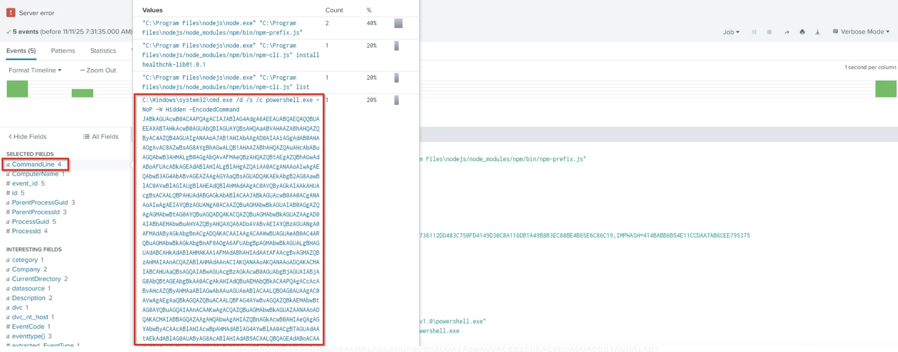
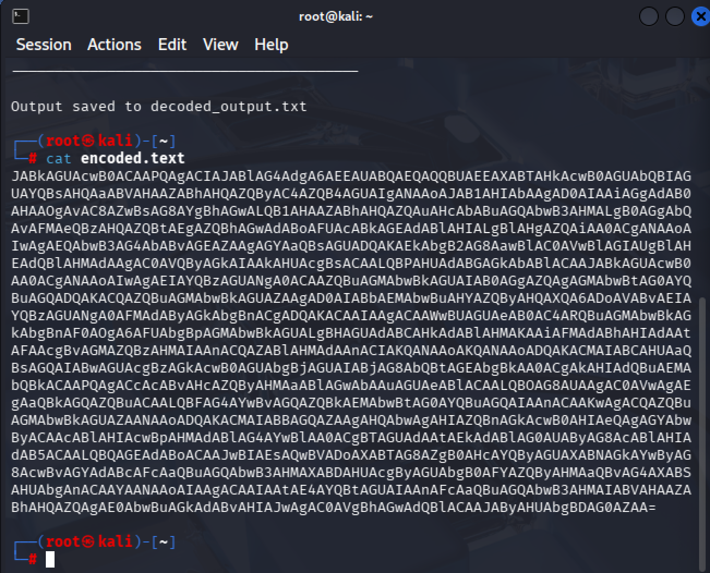
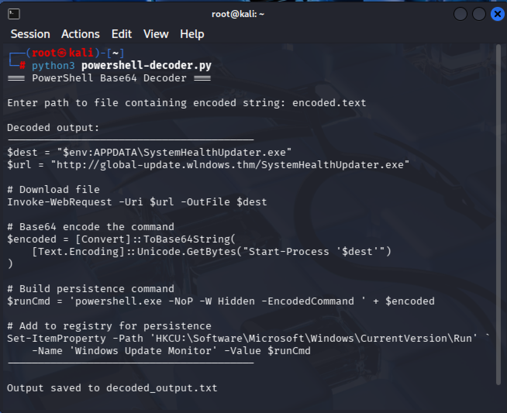

# Threat Hunting Investigation - Supply Chain Compromise
**Platform:** TryHackMe - Threat Hunting Simulator
**Date:** March 2026  
**Severity:** Critical  
**Outcome:** Malicious payload identified, decoded 
and fully analysed

---

## Scenario
PawPressMe, a startup organisation, had recently 
launched their first website built by co-founder 
Tom Whiskers using online tutorials and multiple 
third party packages. Despite the website appearing 
functional, Tom suspected something was wrong and 
requested an investigation.

---

## Hypothesis
An attacker may have leveraged a compromised third 
party software package to gain initial access to 
the system and silently stage a payload for later 
execution, establishing persistence to maintain 
access without immediate detection.

---

## Investigation Process

### Step 1 — Splunk Investigation
My initial approach was to search Splunk for activity 
associated with Tom, the co-founder who had flagged 
the suspicious behaviour. Reviewing the CommandLine 
field within Tom's activity logs I identified four 
values. Three appeared to be legitimate npm activity 
however one entry immediately stood out - a process 
named healthchk-lib@1.0.1 was executing PowerShell 
with hidden and encoded parameters.

PowerShell execution originating from what appeared 
to be an npm package name is a significant red flag, 
particularly combined with the following flags:

- **-NoP** (No Profile) — bypasses PowerShell 
  profiles to avoid detection rules
- **-W Hidden** (hidden window) — executes with 
  no visible window to the user
- **-EncodedCommand** — indicates the true payload 
  has been Base64 encoded to conceal its contents

### Splunk — Suspicious CommandLine Entry Identified

*CommandLine field showing the malicious 
healthchk-lib@1.0.1 entry executing encoded 
PowerShell*

---

### Step 2 - Decoding the Payload

#### Stage 1 - CyberChef Analysis
I extracted the encoded string from the CommandLine 
entry and pasted it into CyberChef for analysis.

Applying the From Base64 operation alone produced 
garbled, unreadable output as shown below.

### CyberChef — From Base64 Only

*Garbled output confirming UTF-16LE decode 
step is required*

Recognising that PowerShell's -EncodedCommand flag 
uses UTF-16LE encoding rather than standard UTF-8, 
I added a second Decode Text operation with 
UTF-16LE (1200) selected which revealed the full 
plaintext script.

### CyberChef — Fully Decoded Output

*Full PowerShell dropper script revealed after 
applying UTF-16LE decode*

---

#### Stage 2 - Custom Python Decoder
To further develop my analysis capability and 
automate this process for future investigations, 
I built a custom Python tool to replicate the 
CyberChef workflow. The tool reads a Base64 encoded 
string from a text file, applies From Base64 
decoding followed by UTF-16LE decoding, prints 
the output to the terminal and automatically saves 
the result to a file for documentation purposes.

The encoded string as it appeared in the text file 
prior to decoding:

### Encoded Payload - As Extracted

*Raw Base64 encoded string as extracted from 
the Splunk CommandLine entry - completely 
unreadable without decoding*

Running the custom decoder against this file 
produced the following output:

### Custom Python Decoder - Output

*Custom built PowerShell Base64 decoder revealing 
the full malicious script - identical output to 
CyberChef confirming tool accuracy*

The tool is available in my python-security-tools 
repository as powershell-decoder.py

---

### Step 3 - Script Analysis
The decoded script revealed a multi-stage malicious 
dropper with three distinct malicious behaviours:

**1. Payload Download**
The script contacts a typosquatted domain -
global-update.wlndows.thm - note the deliberate 
misspelling of "windows" as "wlndows", designed 
to evade casual inspection. It downloads an 
executable named SystemHealthUpdater.exe to the 
user's AppData directory. A location that does 
not require administrator privileges, allowing 
installation without triggering security prompts.

**2. Defence Evasion**
A second layer of Base64 encoding conceals the 
execution command, adding an additional layer of 
obfuscation beyond the initial encoding. Combined 
with hidden window execution the malware runs 
completely silently with no visible indication 
to the user.

**3. Persistence**
The script writes a registry Run key named 
"Windows Update Monitor" under:

HKCU\Software\Microsoft\Windows\CurrentVersion\Run

This name is deliberately chosen to appear as a 
legitimate Windows process, ensuring the malware 
executes automatically every time the user logs 
in and surviving system reboots without 
re-infection.

---

## Threat Scope Assessment
Based on the evidence gathered this attack appears 
to be a targeted supply chain compromise directed 
at PawPressMe through a malicious npm package.

At the time of this investigation there is no 
evidence of wider organisational compromise beyond 
the affected system. However continued monitoring 
is strongly recommended and the affected system 
should be quarantined, to both prevent potential
spread and to rule out any secondary payload 
execution prior to detection.

---

## MITRE ATT&CK Mapping
The following techniques were identified with 
reference to the MITRE ATT&CK framework during 
post-investigation analysis:

| Technique ID | Name | Description |
|---|---|---|
| T1195.002 | Supply Chain Compromise | Malicious npm package used as initial access vector |
| T1059.001 | PowerShell | Encoded PowerShell used to execute payload |
| T1105 | Ingress Tool Transfer | Executable downloaded from typosquatted C2 domain |
| T1027 | Obfuscated Files | Double layer Base64 encoding to evade detection |
| T1547.001 | Registry Run Keys | Persistence via Windows registry startup entry |
| T1036 | Masquerading | Process and registry key named to appear legitimate |

---

## Conclusion
The investigation confirmed that a malicious 
package named healthchk-lib@1.0.1 had been 
installed on the PawPressMe system, consistent 
with the threat intelligence identifying coordinated 
supply chain attacks targeting open source package 
repositories.

The package executed an obfuscated PowerShell 
dropper designed to download a secondary payload 
from a typosquatted domain and establish persistent 
access via the Windows registry. The use of double 
layer encoding, process masquerading and a 
typosquatted domain indicates a sophisticated, 
planned attack rather than an opportunistic one.

The encoded payload was successfully decoded using 
both CyberChef and a custom built Python tool, 
with both methods producing identical output 
confirming the accuracy of the analysis.

---

## Key Lessons
- Supply chain attacks abuse the implicit trust 
  developers place in third party packages - any 
  package executing PowerShell post-install should 
  be treated as highly suspicious
- PowerShell's -EncodedCommand flag is commonly 
  abused for obfuscation - encoded PowerShell 
  execution should always be decoded and analysed
- Typosquatting in domain names requires careful 
  character by character inspection - wlndows vs 
  windows is easy to miss at a glance
- Building custom tools to automate repetitive 
  forensic tasks improves efficiency and 
  consistency across investigations
